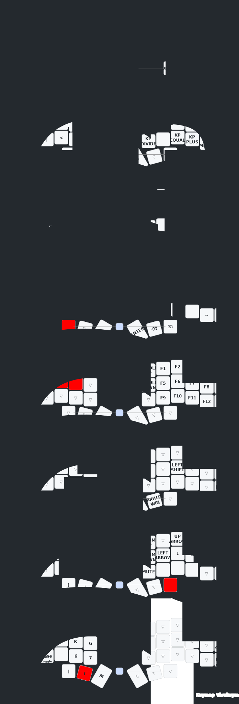

Here you can see the visual changes to the configuration:
> [!NOTE]
>
> This .svg image is automatically generated every time a change is made with
> the keymap editor. Github's workflows are responsible for building and
> generating the .svg file. You just have to go to the
> [keymap-drawer](./keymap-drawer)  folder and open the .svg file with your
> preferred browser if you want to see the files. The keymap-drawer
> configuration file is located in
> [config](./config/config_keymap-drawer.yaml).
> The file for the workflows is in [workflows](./.github/workflows/keymap-drawer.yaml) in case you want to modify it.

[](https://www.youtube.com/c/mctechnology17)


# DISPLAY
1. ePAPER [nice-view]
   - the [nice-view] screen is compiled by default in this repository.
2. OLED
   - the oled screen for the dongle is enabled by default in this repository.
   - If you want to enable the OLED screen for the halves, you can do so by modifying the `.conf` files for their respective halves.
   - Remember to disable the [nice-view] screens to avoid conflict in the compilation.

> [!IMPORTANT]
>
> 1. To modify the dongle's OLED screen you can modify the `.overlay` file as follows for its respective board:
[corne_dongle_xiao.overlay](./config/boards/shields/corne/corne_dongle_xiao.overlay) and
[corne_dongle_pro_micro.overlay](./config/boards/shields/corne/corne_dongle_pro_micro.overlay). There you can find as a comment examples for the 128x32, 128x64, 128x128 screens and [nice-view] for the dongle screen.
> 3. For the 128x128 OLED screen model sh1107 there are no default drivers in Zephyr, so neither in ZMK, but you can add it yourself with this small tutorial (This tutorial is the same for the OLED screens mentioned above):

You just have to modify the following line:
```dts
// replace the following lines for the 128x64 screen by default
&pro_micro_i2c {
    status = "okay";

    oled: ssd1306@3c {
        compatible = "solomon,ssd1306fb";
        reg = <0x3c>;
        width = <128>;
        height = <64>;
        segment-offset = <0>;
        page-offset = <0>;
        display-offset = <0>;
        multiplex-ratio = <63>;
        segment-remap;
        com-invdir;
        inversion-on;
        prechargep = <0x22>;
    };
};
// for this (i.e. just copy and paste) replace the 128x64 screen with the 128x128 sh1107 screen
&pro_micro_i2c {
    status = "okay";
    oled: sh1106@3c {
        compatible = "sinowealth,sh1106";
        reg = <0x3c>;
        width = <120>;
        height = <128>;
        segment-offset = <0>;
        page-offset = <0>;
        display-offset = <0>;
        multiplex-ratio = <119>;
        segment-remap;
        com-invdir;
        inversion-on;
        prechargep = <0x22>;
        };
};

```


# RGB
> [!WARNING]
>
> 1. If you use [nice-view] you cannot use rgb, since [nice-view] uses the same
>    pinout as rgb.

If you are interested in using RGB on your keyboard you can see the
configuration in the branch
[power/domains-and-device-runtime](https://github.com/mctechnology17/zmk-config/tree/power/domains-and-device-runtime)
from this same repository.

Here is an example of what it looks like:
[](https://www.youtube.com/c/mctechnology17)

# DONGLE
> [!TIP]
>
> 1. You can connect the display to the dongle directly to the i2c port of the
> handwired style dongle, or you can connect it to a usb-c port of the pcb
> style dongle.
> 2. You can see the connections in the following diagram for [seeeduino_xiao_ble](./src/pinout-seeeduino_xiao_ble.png) and for the boards with [pro_micro](./src/pinout-pro_micro.png) connections as the [nice_nano_v2] and the [puchi_ble_v1].
> 3. You can print a case for the dongle, you can see the designs below in the section [Dongle Designs](#Dongle-Designs).
> 4. You can print a pcb for the dongle, you can see the designs in the section [Dongle Designs](#Dongle-Designs).
> 5. You can program a macro that references the `&bootloader` action so that the dongle enters bootloader mode and you can flash the firmware again. The macros are executed on the master so this action causes the dongle to enter bootloader mode. Thanks @chadtrans for the tip!

In the following image you can see how you can connect the OLED screen to the
dongle:
[](https://www.youtube.com/c/mctechnology17)

Information about this image:
- The photo shows a [seeeduino_xiao_ble] dongle with an OLED 128x128 sh1107 display connected to the handwired style i2c port. This dongle acts as master.
- The left side acts as peripheral in this case, the board is a [puchi_ble_v1].
- The right side acts as a peripheral in this case, the board is a [nice_nano_v2].
- The photo shows a clone [nice_nano_v2] dongle with an OLED display connected to a traditional i2c port in a pcb style. This dongle is only for sample photo and is not connected to any device shown in the photo.

Macro example to enter bootloader mode. On  your
[corne.keymap](./config/corne.keymap) file you can add the following macro (Thanks @chadtrans for the tip!):
> [!TIP]
>
> 1. You can program this macro with the online editor [keymap-editor]

```c
// this is the manual way to do it
#define MACRO(name, keys)           \
name: name##_macro {                \
	compatible = "zmk,behavior-macro";\
	#binding-cells = <0>;             \
	tap-ms = <1>;                     \
	wait-ms = <1>;                    \
	bindings = <keys>;                \
};
MACRO(dongle_boot, &bootloader)
/ {
   keymap {
      compatible = "zmk,keymap";
     ... // other layers
     config_layer {
        display-name = "CON";
        bindings = <
	... // other bindings
	&dongle_boot
	... // other bindings
     };
     ... // other layers
};
```

# USEFUL TIPS
> [!TIP]
>
> Below are some useful tips for using your corne keyboard with this
> configuration.

- You can add a reset key on each half, that's useful for when your halves disconnect/desynchronize, or something unusual happens. That way the firmware is loaded again. see reference in [corne.keymap](./config/corne.keymap)
- You can add a bootloader activator on each half in case you don't have access to the bootloader button, it is useful in case your case is not optimized or you just want that option. see reference in [corne.keymap](./config/corne.keymap)
- If both halves were disconnected/unsynchronized, you just have to press the reset button on both halves 10 times in a row and they will reconnect.
- If you want to flash the firmware again you just have to connect the keyboard (that is, one half first, usually the left one) press the reset button 2 times in a row
  and your device is recognized as a hard disk storage drive, then just drag the file to flash and that's it. do the same with the other half.
- Remember that if your corne only has some functional RGB lights you can activate only the ones that you have functional, it is not necessary to activate all the lights. see reference in [led strip](./config/corne.keymap)
- You can combine the boards, for example: on the left you can have a [nice_nano_v2], on the right a [puchi_ble_v1] and on the dongle a [seeeduino_xiao_ble] or some clone [nice_nano_v2], or any combination you can think of.

# RELATED PROJECTS

I used this project as a reference to configure the dongles with OLED screen:
- [cygnus](https://github.com/rain2813/zmk-cygnus-oled.git) by @rain2813
- [zmk keyboard Macintosh dongle display](https://makerworld.com/en/models/403660) by @rain2813
- [corne with dongle](https://github.com/tomgroenwoldt/zmk-config.git) by @tomgroenwoldt
- [zmk-dongle-display](https://github.com/englmaxi/zmk-dongle-display.git) by @englmaxi
- [zmk-config for module](https://github.com/englmaxi/zmk-config/tree/master/boards/shields) by @englmaxi
- [zmk-config for dongle pro micro](https://github.com/joaopedropio/zmk-swoop/tree/dongle-sdd1306) by @joaopedropio

In the following animations created by @englmaxi you can see what the dongle
looks like with the 128x64 OLED screen:


In that animation you can see the connection or output with the computer, that
is, if it is through a USB or Bluetooth port. Also information about the status
of both batteries.


In this animation you can see the actions of the modifier keys, such as
control, shift, alt, windows/mac, etc.

# DONGLE DESIGNS
- [case1](https://github.com/englmaxi/zmk-dongle-display/raw/main/cases/case1.zip) by @englmaxi
- [case2](https://github.com/englmaxi/zmk-dongle-display/raw/main/cases/case2.zip) by @englmaxi
- [Cyberdeck](https://github.com/rafaelromao/keyboards/tree/main/stls/Dongle) by @rafaelromao
- [Dongle PCB](https://github.com/spe2/zmk_dongle_hardware) by @spe2
- [Macintosh](https://makerworld.com/en/models/403660) by @rain2813
- [Redox](https://makerworld.com/en/models/242951) by @rurounikexin
- [ZMK Display Dongle](https://makerworld.com/en/models/496738) by @yingeling

An example of Dongle Designs (by @rain2813):
[](https://www.youtube.com/c/mctechnology17)

# INSPIRATIONS

- [englmaxi/zmk-config](https://github.com/englmaxi/zmk-config)
- [caksoylar/zmk-config](https://github.com/caksoylar/zmk-config)
- [joelspadin/zmk-locale-generator](https://github.com/joelspadin/zmk-locale-generator)
- [minusfive/zmk-config](https://github.com/minusfive/zmk-config)
- [infused-kim/zmk-config](https://github.com/infused-kim/zmk-config)
- [urob/zmk-config](https://github.com/urob/zmk-config)

# MY OTHER PROJECTS:
- [qmk-config] will be updated soon
- [qmk_userspace] will be updated soon
- [vimtools] swiss army knife for vim (features and settings that will make your life easier)
- [gm] cross-platform git manager with friendly user interface
- [vim-better-header] the best automated template
- [vim-executor] multilanguage code executor

If you enjoy my contributions, feel free to donate. I appreciate if you follow me on [github] and [youtube]
- [paypal]
- [sponsor]

[^1]: Keymap-drawer, https://github.com/caksoylar/keymap-drawer https://keymap-drawer.streamlit.app/
[^2]: caksoylar zmk-config example for keymap-drawer https://github.com/caksoylar/zmk-config
[^3]: Install pipx, https://pipx.pypa.io/stable/
[^4]: Urob zmk-config, https://github.com/urob/zmk-config
[^5]: Urob ZMK Firmware: Personal fork, https://github.com/urob/zmk/

[qmk-config]: https://github.com/mctechnology17/qmk-config
[qmk_userspace]: https://github.com/mctechnology17/qmk_userspace
[github]: https://github.com/mctechnology17
[twitter]: https://twitter.com/mctechnology17
[youtube]: https://www.youtube.com/c/mctechnology17
[instagram]: https://www.instagram.com/mctechnology17/
[facebook]: https://m.facebook.com/mctechnology17/
[reddit]: https://www.reddit.com/user/mctechnology17
[nice-view]: https://nicekeyboards.com/nice-view
[puchi_ble_v1]: (https://keycapsss.com/keyboard-parts/mcu-controller/202/puchi-ble-wireless-microcontroller-pro-micro-replacement?number=KC10157_SWITCH&c=18)
[seeeduino_xiao_ble]: (https://keycapsss.com/keyboard-parts/mcu-controller/212/seeed-studio-xiao-nrf52840-rp2040-esp32c3?number=KC10167_NRF)
[nice_nano_v2]: (https://nicekeyboards.com/nice-nano)
[keymap-editor]: https://nickcoutsos.github.io/keymap-editor/
[ZMK firmware]: https://github.com/zmkfirmware/zmk/
[ZMK documentation]: https://zmk.dev/docs/user-setup
[ZMK keycodes]: https://zmk.dev/docs/codes
[ZMK Discord]: https://zmk.dev/community/discord/invite
[git]: (https://github.com/git-guides/install-git)

[vim-executor]: https://github.com/mctechnology17/vim-executor
[vim-better-header]: https://github.com/mctechnology17/vim-better-header
[gm]: https://github.com/mctechnology17/gm
[vimtools]: https://github.com/mctechnology17/vimtools
[jailbreakrepo]: https://mctechnology17.github.io/
[uiglitch]: https://repo.packix.com/package/com.mctechnology.uiglitch/
[uiswitches]: https://repo.packix.com/package/com.mctechnology.uiswitches/
[uibadge]: https://repo.packix.com/package/com.mctechnology.uibadge/
[youtuberepo]: https://github.com/mctechnology17/youtube_repo_mc_technology
[sponsor]: https://github.com/sponsors/mctechnology17
[paypal]: https://www.paypal.me/mctechnology17
[readline]: https://github.com/PowerShell/PSReadLine/blob/master/README.md
