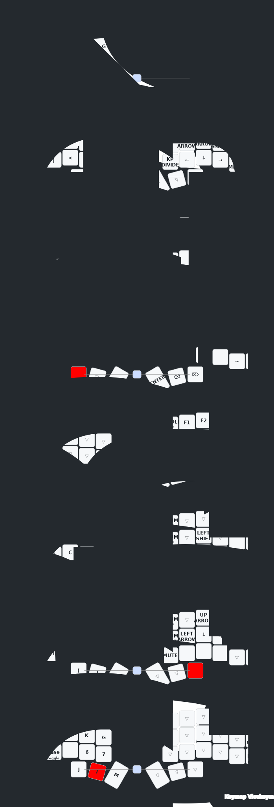

Here you can see the visual changes to the configuration:
> [!NOTE]
>
> This .svg image is automatically generated every time a change is made with
> the keymap editor. Github's workflows are responsible for building and
> generating the .svg file. You just have to go to the
> [keymap-drawer](./keymap-drawer)  folder and open the .svg file with your
> preferred browser if you want to see the files. The keymap-drawer
> configuration file is located in
> [config](./config/config_keymap-drawer.yaml).
> The file for the workflows is in [workflows](./.github/workflows/keymap-drawer.yaml) in case you want to modify it.

[](https://www.youtube.com/c/mctechnology17)


# DISPLAY
1. ePAPER [nice-view]
   - the [nice-view] screen is compiled by default in this repository.
2. OLED
   - the oled screen for the dongle is enabled by default in this repository.
   - If you want to enable the OLED screen for the halves, you can do so by modifying the `.conf` files for their respective halves.
   - Remember to disable the [nice-view] screens to avoid conflict in the compilation.

> [!IMPORTANT]
>
> 1. To modify the dongle's OLED screen you can modify the `.overlay` file as follows for its respective board:
[corne_dongle_xiao.overlay](./config/boards/shields/corne/corne_dongle_xiao.overlay) and
[corne_dongle_pro_micro.overlay](./config/boards/shields/corne/corne_dongle_pro_micro.overlay). There you can find as a comment examples for the 128x32, 128x64, 128x128 screens and [nice-view] for the dongle screen.
> 3. For the 128x128 OLED screen model sh1107 there are no default drivers in Zephyr, so neither in ZMK, but you can add it yourself with this small tutorial (This tutorial is the same for the OLED screens mentioned above):

You just have to modify the following line:
```dts
// replace the following lines for the 128x64 screen by default
&pro_micro_i2c {
    status = "okay";

    oled: ssd1306@3c {
        compatible = "solomon,ssd1306fb";
        reg = <0x3c>;
        width = <128>;
        height = <64>;
        segment-offset = <0>;
        page-offset = <0>;
        display-offset = <0>;
        multiplex-ratio = <63>;
        segment-remap;
        com-invdir;
        inversion-on;
        prechargep = <0x22>;
    };
};
// for this (i.e. just copy and paste) replace the 128x64 screen with the 128x128 sh1107 screen
&pro_micro_i2c {
    status = "okay";
    oled: sh1106@3c {
        compatible = "sinowealth,sh1106";
        reg = <0x3c>;
        width = <120>;
        height = <128>;
        segment-offset = <0>;
        page-offset = <0>;
        display-offset = <0>;
        multiplex-ratio = <119>;
        segment-remap;
        com-invdir;
        inversion-on;
        prechargep = <0x22>;
        };
};

```


# DONGLE
> [!TIP]
>
> 1. You can connect the display to the dongle directly to the i2c port of the
> handwired style dongle, or you can connect it to a usb-c port of the pcb
> style dongle.
> 2. You can see the connections in the following diagram for [seeeduino_xiao_ble](./src/pinout-seeeduino_xiao_ble.png) and for the boards with [pro_micro](./src/pinout-pro_micro.png) connections as the [nice_nano_v2] and the [puchi_ble_v1].
> 3. You can print a case for the dongle, you can see the designs below in the section [Dongle Designs](#Dongle-Designs).
> 4. You can print a pcb for the dongle, you can see the designs in the section [Dongle Designs](#Dongle-Designs).
> 5. You can program a macro that references the `&bootloader` action so that the dongle enters bootloader mode and you can flash the firmware again. The macros are executed on the master so this action causes the dongle to enter bootloader mode. Thanks @chadtrans for the tip!

In the following image you can see how you can connect the OLED screen to the
dongle:
[](https://www.youtube.com/c/mctechnology17)

Information about this image:
- The photo shows a [seeeduino_xiao_ble] dongle with an OLED 128x128 sh1107 display connected to the handwired style i2c port. This dongle acts as master.
- The left side acts as peripheral in this case, the board is a [puchi_ble_v1].
- The right side acts as a peripheral in this case, the board is a [nice_nano_v2].
- The photo shows a clone [nice_nano_v2] dongle with an OLED display connected to a traditional i2c port in a pcb style. This dongle is only for sample photo and is not connected to any device shown in the photo.

Macro example to enter bootloader mode. On  your
[corne.keymap](./config/corne.keymap) file you can add the following macro (Thanks @chadtrans for the tip!):
> [!TIP]
>
> 1. You can program this macro with the online editor [keymap-editor]

```c
// this is the manual way to do it
#define MACRO(name, keys)           \
name: name##_macro {                \
	compatible = "zmk,behavior-macro";\
	#binding-cells = <0>;             \
	tap-ms = <1>;                     \
	wait-ms = <1>;                    \
	bindings = <keys>;                \
};
MACRO(dongle_boot, &bootloader)
/ {
   keymap {
      compatible = "zmk,keymap";
     ... // other layers
     config_layer {
        display-name = "CON";
        bindings = <
	... // other bindings
	&dongle_boot
	... // other bindings
     };
     ... // other layers
};
```

# INSPIRATIONS

- [englmaxi/zmk-config](https://github.com/englmaxi/zmk-config)
- [caksoylar/zmk-config](https://github.com/caksoylar/zmk-config)
- [joelspadin/zmk-locale-generator](https://github.com/joelspadin/zmk-locale-generator)
- [minusfive/zmk-config](https://github.com/minusfive/zmk-config)
- [infused-kim/zmk-config](https://github.com/infused-kim/zmk-config)
- [urob/zmk-config](https://github.com/urob/zmk-config)


